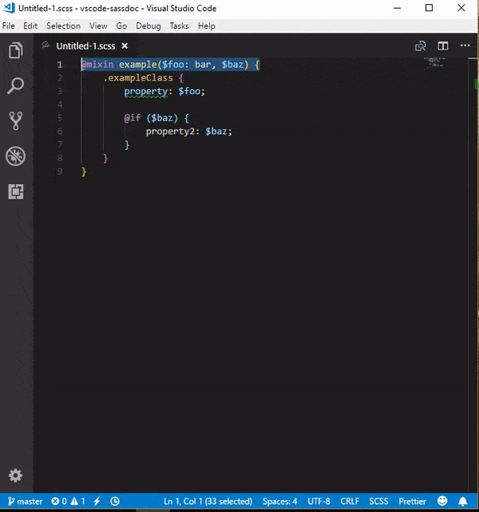

# vscode-sassdoc

Add a command to automatically insert SassDoc comments into your stylesheets

## Features

## Release Notes

Users appreciate release notes as you update your extension.

### 1.0.0

Initial release of vscode-sassdoc.
